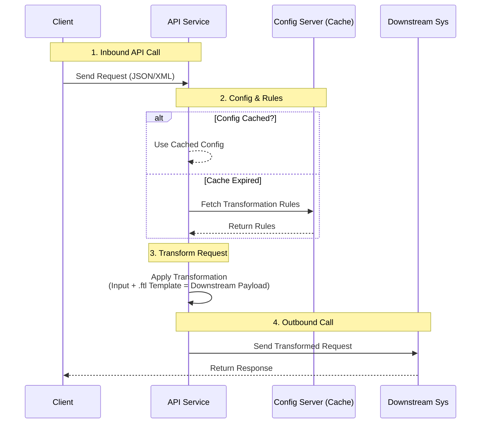

# Apache FreeMarker JSON Transformation Demo

## Setup Instructions

### 1. Build the Project

```bash
./gradlew clean build
```

### 2. Create Templates Directory

```bash
mkdir -p templates
```

Copy the `customer-transform.ftl` template to the `templates` directory.

### 3. Run the Application

```bash
./gradlew bootRun
```

Or run the JAR:

```bash
java -jar build/libs/freemarker-demo-0.0.1-SNAPSHOT.jar
```

## API Usage

**cURL Example**:

```bash
curl -X POST http://localhost:8080/api/transform/customer \
  -H "Content-Type: application/json" \
  -d @sample-request.json
```


## Mermaid

## Drawback
A. No "JSON Awareness" (The Comma Problem) - FreeMarker treats the output as plain text. It does not know it is generating JSON. If you make a logic error, you generate invalid JSON.
B. Lack of Type Safety -> Since templates are interpreted text, you have zero compile-time safety. If you type ${user.nmae} instead of ${user.name}, you won't know until the code actually runs and crashes (or prints empty text).
C. Hard to Debug
D. White space issue -> Because you are generating JSON (data), you want the file size to be small. But if you format your template to be readable for humans, FreeMarker will fill your output with thousands of useless blank lines and spaces.

## Solution
1. The "Strict DTO" Rule (Stop using Maps)
   The biggest mistake developers make is converting objects to Map<String, Object> before sending them to FreeMarker. This erases all type information.
```java
// Logic is hidden in "put" calls. FreeMarker doesn't know if "User" has "getAge()".
Map<String, Object> model = new HashMap<>();
model.put("user", userObj);
```
Safe Practice: Pass the actual Java Object. FreeMarker can call getters (getAge()). If you rename getAge() to getYears() in Java, your IDE will refactor the Java code, but break the template. However, if you run the "Compiler Test" (below), you catch this instantly.
2. The "Compiler" Test (The Golden Solution)
   Since you cannot compile .ftl files, you must create a Unit Test that acts as a compiler.

## The 5,000-Line File Scenario
1. Main Template (main.ftl)
```injectedfreemarker
<#import "parts/header.ftl" as h>
<#import "parts/customer.ftl" as c>
<#import "parts/accounts.ftl" as a>

{
  "header": <@h.renderHeader data=headerData />,
  "body": {
    "customer": <@c.renderCustomer data=customerData />,
    "accounts": <@a.renderAccounts list=accountList />
  }
}
```
2. Component Template (parts/customer.ftl)
```injectedfreemarker
<#macro renderCustomer data>
  {
    "firstName": "${data.firstName}",
    "lastName": "${data.lastName}"
  }
</#macro>
```